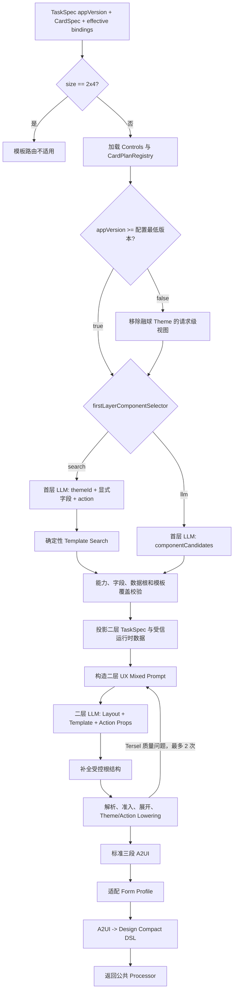

# Template Generation 流程架构

## 1. 定位与依赖方向

Template Generation 是公共生成链中可替换的 source DSL generator，不是独立的卡片生成服务。
调用方先完成能力和协议裁决，再将已构造的 TaskSpec、CardSpec 和有效绑定交给模板模块。


依赖必须保持单向：

```text
WidgetGenerationService
  -> template_generation.facade
     -> template_generation.engine
        -> Provider/Theme/CardTpl 资源

template_generation -X-> WidgetGenerationService 私有方法
template_generation -X-> CardSpecBuilder / TaskSpecBuilder
template_generation -X-> ArtifactValidator / ArtifactStore / ResponsePlanner
```

## 2. 入口路由差异

Compact 和 Tersel 入口分别构造 `TemplateSourceGenerator` 对象，并设置各自的模板候选、Action、样例覆盖等
差异属性。`WidgetGenerationService._generate_widget_card_with_policy()` 只负责向对象绑定当前 Processor、
Form Profile、模型运行时和请求上下文，再将其注入公共生成链。回退策略仍在公共 `generate_source_dsl()` 中
执行，不进入模板模块。

| 场景 | Compact | Tersel |
| --- | --- | --- |
| create | 先尝试 Template | 只允许 Template |
| edit | 跳过 Template，进入原 Compact edit | 入口直接 `failed` |
| Template 不匹配或模块异常 | 同一次 `generate_source_dsl` 回退原 Compact 模型 | 不回退，转为生成失败 |
| Template 已返回，Processor/Validator 失败 | 进入公共 Compact repair | 进入公共 Compact repair |
| repair 最终失败 | `VALIDATION_FAILED`，不保存 | 同左 |
| ArtifactStore 失败 | 不回退 Template 或模型 | 同左 |

两个入口当前都构造 `DslProcessorKind.DESIGN_COMPACT` 策略。
`generateWidgetCardTerseDslNested2` 的名称表达模板内部编排语义；生产路线不把 Tersel
字符串交给公共 Processor，旧 TerseDSL 公共 Processor 已删除。

## 3. Template 内部主流程

当前 `template_controls.json` 的 `firstLayerComponentSelector` 默认为 `search`。该路线不让首层模型
直接选最终 Template，而是让它标定用户显式字段、Theme 和 Action，再由服务端 Search
确定可交给二层的候选。



### 3.1 资源加载和准入

`CardPlanRegistry` 启动时完成以下确定性工作：

1. 加载各业务 Provider Bundle、Layout Provider、Action Provider、分散式 Theme 和共享 Theme Base。
2. 编译 `.cardtpl`，校验模板 ID、Props、数据路径、children 槽位和组件闭包。
3. 从 `provider.json#templates` 派生“业务 -> Template -> 数据能力 -> Provider”索引。
4. 应用 `disabledProviderIds` 和 `disabledTemplateIds`，确保禁用项不进入首层和二层。
5. `TemplateSourceGenerator` 读取已有 `TaskSpec.appVersion`，与
   `CONFIG.fusion_ball_min_prd_version` 比较；配置或版本缺失、非法、低于配置版本时关闭。模板模块不重新从
   请求取值，也不维护另一份应用版本。只有内部 `enable_fusion_ball=true` 时才构造包含融球 Theme 的请求级
   视图；关闭时移除所有
   `fusionBallStyle` Theme 及其首层规则和场景索引。
6. 建立字段 Search 索引，供 `retrieve_template_variants()` 查找可覆盖候选。

Provider Template 和业务分组只从各自 `provider.json` 与 `.cardtpl` 派生；Theme 只从
`themes/<theme-id>/theme.json` 加载。`themes/base/theme-base.json` 仅保存跨主题一致的 UX Token、尺寸预算
和内容颜色属性映射，不保存任何具体主题值。

注册表或 Controls 无法严格加载时，模板路由不可用。Compact 是否继续原生成链取决于
`need_fallback`；Tersel 不回退。

融球开关关闭后，Search 和旧 LLM 首层 Prompt 均不能看到融球 Theme 的 ID、描述和首层规则；二层与
编译阶段复用同一过滤视图，因此伪造融球 Theme ID 会按未知 Theme 拒绝，而不是在最终转换时静默忽略。

模板 Search 当前整体不支持 `2x4`。这类请求在 Registry、首层 Prompt 和模型调用前直接返回模板不适用；
Compact create 进入原 Compact 回退，Tersel 模板入口直接失败。Wide 资源当前只作后续能力预留。

### 3.2 首层 Search

Search 路线的首层输出是 `TemplateRetrievalQuery`：

```json
{
  "themeId": "fusion-weather-blue",
  "requiredOutputFieldsByCapability": {
    "ViewWeather": ["/current/temperatureText", "/current/condition"]
  },
  "action": ["event.open.weather"]
}
```

首层不能输出组件、Template、布局、Props 或尺寸。服务端 Search 继续校验：

- 能力 ID 必须来自有效数据绑定。
- 字段必须逐字来自对应 `candidateOutputFields`。
- CardSpec 写入根必须与 Provider `dataDomain` 一致。
- 模板的 `primaryData` 和 `secondaryData` 必须都能从 TaskSpec 中取得。
- Search 当前只接受一个数据业务，可外加最多两个显式 Action；候选解析后命中多个业务时，在布局后缀过滤和
  二层模型调用前显式返回模板不适用。
- 首层必须完整标定用户显式字段，不得为了迁就布局限制而省略其他业务。
- Search 按 Action 数过滤布局后缀，同时要求每个保留的 Template 独立完整覆盖所属业务的用户显式字段：
  单业务零、一个、两个 Action 分别保留 Full、Hero+Full、Compact。
- `Support`、`Compact`、`Hero`、`Full`、`WideHero`、`WideFull` 的最终组合由第二层完成。
- `Support`、`TwoSupportLayout` 和 `2x2-two-support` 保留给旧 LLM 选择器兼容测试和原子预览，当前 Search 路径不可达。

结果是 `TemplateRouteSelection`，其 `availableTemplateIds` 仍是二层候选集，不是最终选择。

### 3.3 二层组合

`build_ux_mixed_prompt()` 只向二层暴露：

- 首层通过的业务 Template 候选，以及每个候选的用途描述、完整 Props Schema、必填/可选关系、
  参数关系和素材参数可用源。
- 根据当前尺寸、业务数量、Action 数量和素材条件确定的一个或多个 Layout Template 完整契约。
- 已批准的 Action ID/文案、当前 Action Template 完整签名、可用素材和 Theme ID。
- 删除未候选模板目录后的 Provider 二层业务指导。

二层 system Prompt 不复用通用 Hybrid/Design Compact 规则，只保留类 Tersel 直接
`Template(...)` 调用语法和安全禁止项。二层不接收 TaskSpec、`dataFacts`、`mustKeep` 或数据样例，
只输出受限的 Layout/Template 调用和
展示 Props。业务 Template 是不可拆分的原子节点，禁止用基础组件补业务内容。候选经布局后缀、Action
数量或必需参数筛选后为空时直接失败。单业务一个 Action 时，若存在语义匹配图标，二层可在
`HeroActionLayout + PillAction` 与 `FullIconActionLayout + IconAction` 中选择。当前 Search 不会向二层下发多业务候选。二层不能输出原始
`call/args`，也不能绕过
必选事件使用 `EventAction(props.actionId)` 生成交互；Support 的可选事件使用
`EventAction(props?.actionId)`，未提供 `actionId` 时不生成 `onClick`。

### 3.4 受信编译与展开

`compile_ux_layout_card()` 是二层输出到 A2UI 的硬边界。它主要执行：

1. 用闭包语法解析器读取 Layout 根、业务 Template 和 Action Template。
2. 校验原始组件数、层级、允许的 Template ID、Props 类型和必传数据。
3. 按布局后缀校验卡片尺寸、业务节点数和 Action 类型/数量。
4. 展开 CardTpl，处理 `Bind`、`Param`、`Asset`、运行时 `Expr`、生成期三元、条件节点和 children 槽位；
   生成期三元只按路径或 Prop 可用性选择直接绑定或确定值，不进入最终 A2UI 表达式。
5. 将 Action Template 的 `EventAction(props.actionId)` 实体化为已批准事件；对 Support 中的
   `EventAction(props?.actionId)`，缺少 `actionId` 时省略 `onClick`。
6. 将 Theme `rootStyle` 应用到卡片根节点；为未显式着色的内容组件补 `primaryColor`；确定性展开
   CardTpl/Tersel 中的 `$theme(...)`；将 `actionStyle` 的背景色和内容色应用到受信 Action Template，保留
   模板节点已经显式声明的高度、圆角、字号和字重，然后执行布局 Lowering。`TwoSupportLayout` 额外从
   布局专用主题读取 `supportContentStyle`，统一设置两个 Support 容器的背景色和圆角。
7. 仅当实际产物为单业务 `Full`、`Hero` 或 `Compact` 时，按 Theme 三色在模板内部直接展开标准 `Stack` 球体树，
   同时给前景内容根 ID 增加 `__genui_render_component__` 前缀；不猜测或覆写主辅内容色。
8. 将已经展开的标准组件树序列化为 Tersel，再确定性转换为三段 A2UI。
9. 回转 A2UI-Compact 并经公共 Processor 重新生成完整 A2UI 后执行 artifact 校验。A2UI-Compact 不接受
   或保留 `FusionBall` 云端组件。

二层输出发生 `TerselConversionError` 时，模板模块在首次生成后最多使用两次二层修复。
这与模块返回后的公共 Compact repair 是两套不同的质量阶段。

## 4. 数据形态变换

```text
调用方 TaskSpec
  -> content selectors 和字段 Search
  -> 二层投影 TaskSpec（只保留组合所需事实）
  -> 恢复 Provider 必需运行时路径和事件依赖
  -> Tersel 组件树 + data
  -> 标准 A2UI createSurface/updateComponents/updateDataModel
  -> 当前 Form Profile A2UI
  -> Design Compact DSL
  -> 公共 DesignCompactProcessor
  -> 最终标准 A2UI
```

回转 Design Compact DSL 的目的是让 Template 产物与原 Compact 产物共用同一 Processor、Validator、
repair 和 artifact 格式，并在 `designcompactdsl` 中保留可回放的源 Token。

## 5. 失败分类

| 异常或拒绝 | 所在阶段 | 语义 |
| --- | --- | --- |
| `TemplateModelUnavailable` | facade/model client | 当前没有可用的真实共享模型运行时 |
| `TemplateRouteNotApplicable` | Registry、首层或 Search | 无法证明当前模板可完整覆盖需求 |
| `TemplateRetrievalMiss` | Search | 能力、字段、单业务或数据根约束不成立 |
| `TemplateGenerationError` | 二层生成或编译 | 已确认候选后仍无法生成合法模板产物 |
| `TemplateSourceAdapterError` | A2UI/Profile/Compact 回转 | 模板 A2UI 不能成为当前 Processor 源格式 |
| `CompactDslConversionError` | 模板本地回转或公共 Processor | Design Compact 语法或语义转换失败 |

模板模块将其中大部分拒绝以异常传回公共 source generator。是回退还是失败由入口的
`need_fallback` 决定，不应在模板内部吞掉异常后自行构造业务响应。

## 6. 并发、通知与重试

- `before_model_call` 在公共 `generate_source_dsl()` 进入 Template 或原模型前统一执行。
- Template 首层和二层通过 `TemplateModelClient` 复用同一 `ModelExecutionRuntime`。
- Compact 的 Template 尝试失败后转原模型，仍属于同一次 source generation，不重复下发开始通知。
- 模板内部的二层修复最多 2 次；公共 Compact repair 由服务配置和 `RetryController` 控制。
- source DSL 一旦成功返回，后续 Processor、Validator、repair 或保存失败都不会重跑 Template。

## 7. 安全和可维护性不变量

- 模型输出只是候选决策或受限语法，不能绕过服务端 Search、准入和编译。
- 所有动态路径必须来自 TaskSpec/CardSpec/Provider 契约；不得根据展示值反推绑定。
- 禁用 Provider 和 Template 必须在 Prompt 前过滤，并在编译前再次拒绝。
- Layout、Action、Theme、组件数、深度和素材都必须通过确定性校验。
- 新增 Provider 应修改资源与测试，不应在系统 Prompt 或 Python 分支中复制同一垂域契约。
