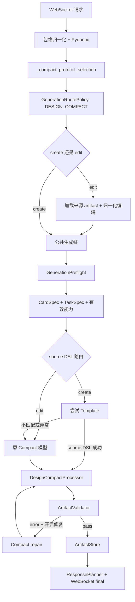

# `generateWidgetCardCompactDsl` Template 数据流

本文说明 Compact create 请求如何尝试 Template，以及 Template 失败后如何回退原 Compact 模型。
对外契约以 [云侧方案设计](../../../../../docs/云侧方案设计.md) 为准；共享模板内部流程见
[architecture.md](architecture.md)。

## 1. 入口特性

| 项目 | 当前实现 |
| --- | --- |
| WebSocket | `/api/v1/ws/tools/generateWidgetCardCompactDsl` |
| 请求模型 | `GenerateWidgetCardRequest` |
| 公共 Processor | `DslProcessorKind.DESIGN_COMPACT` |
| Template | create 时尝试，edit 时跳过 |
| Template 异常 | `need_fallback=true`，回退原 Compact 模型 |
| edit | 支持，由 `enable_widget_edit` 和来源 artifact 校验控制 |
| 最终产物 | 三段标准 A2UI，并保留 `designcompactdsl` 源 Token |
| 质量失败 | 严格模式，最终失败不保存 artifact |

主要代码：

- [WebSocket 路由](../../../api/routes.py)
- [Compact 入口和公共生成链](../../widget_generation_service.py)
- [模板 source DSL 入口](../facade.py)
- [公共 Design Compact Processor](../../generation_pipeline.py)

## 2. 总流程



## 3. WebSocket 和协议选择

`generate_widget_card_compact_dsl_ws()` 通过 `_serve_operation_websocket()` 处理包络、心跳、请求 ID 和错误帧。
有效请求交给 `WidgetGenerationService.generate_widget_card_compact_dsl()`。

`_compact_protocol_selection()` 根据 App/ROM 映射同时选出：

- 最终 A2UI Form `protocolProfileId`。
- 模型源格式和转换使用的 `designProfileId`。

未命中且不允许默认 Profile 回退时，在进入能力裁决和模型前返回
`APP_VERSION_UNSUPPORTED`。请求自带的 Profile 不能覆盖路由选择。

## 4. Create 与 edit

### Create

`EditRequestNormalizer.normalize_create()` 补齐默认尺寸和候选数组。
入口先为 create 构造 `TemplateSourceGenerator`，`_generate_widget_card_with_policy()` 再补齐：

- 已构造的 TaskSpec。
- 已构造的 CardSpec JSON。
- 前置门禁通过的数据绑定。
- 当前 Processor、Form Profile、模型运行时和请求上下文。

对象配置完成后作为可调用的 template source generator 注入公共 `generate_widget_card()`；公共策略函数不再
接收 `try_template` 或画廊专用参数。

### Edit

当请求显式包含 `sourceArtifactUrl` 时，路由跳过 Template，直接进入原 Compact edit：

```text
SourceArtifactRepository.load
  -> 校验 artifact schema 和 designcompactdsl
  -> EditRequestNormalizer.normalize_edit
  -> 重建 CardSpec/TaskSpec
  -> 原 Compact edit Prompt
```

来源加载失败不转为 create，也不会覆盖来源 artifact。

## 5. 前置门禁和 Template 输入

公共 `GenerationPreflight` 在 Template 之前完成：

- 数据能力注册、`arguments` Schema、`writeResultTo` 和写入冲突校验。
- `candidateOutputFields` 路径和数组投影校验。
- 事件模板、固定参数、动态依赖和素材校验。
- CardSpec、TaskSpec、有效能力、移除项和 warning 构造。

调用方契约错误在该阶段整单拒绝，不进入 Template 或原 Compact 模型。
Template 不重新查询 IDS，也不修改 CardSpec 和 TaskSpec 的业务契约。

## 6. Template 和原 Compact 回退

`generate_source_dsl()` 先统一执行 `before_model_call`，然后尝试
`request_template_source_dsl()`。

Template 成功时：

```text
Template A2UI
  -> 适配当前 Form Profile
  -> A2UI 回转 Design Compact DSL
  -> require_generated_dsl
  -> DesignCompactProcessor
```

以下任一情况会使 Template source generator 抛出异常：

- 无可用模板模型运行时。
- Registry/Controls/Provider 资源无法加载。
- 首层字段标定或确定性 Search 无完整覆盖。
- 二层生成、受信编译、A2UI 适配或 Compact 回转失败。

Compact 的 `need_fallback=true`，因此公共 source generator 记录异常类型后，在同一次生成中调用已构造的
`A2UIModelClient` 原 Compact Prompt。Template 已返回 DSL 后发生的 Processor/Validator 错误不属于此回退，
只能进入公共 repair。

## 7. Processor、校验和 repair

`DesignCompactProcessor.process()` 依次执行：

```text
repair_compact_dsl_binding_paths
  -> validate_compact_dsl_context
  -> read_design_protocol_profile
  -> convert_compact_dsl_to_a2ui
```

Template 命中融球 Theme 时，进入 A2UI-Compact 前已经是标准 `Stack` 球体树，且前景内容根 ID 已带
`__genui_render_component__` 前缀。公共 Processor 只负责常规 Compact 转换；`FusionBall` 不是
A2UI-Compact 组件，输入包含该类型时直接按不支持组件拒绝。

转换成功后，`ArtifactValidator` 校验完整 artifact 候选。转换或校验 error 会进入
`RetryController`；是否修复及最大次数由公共配置控制。修复模型必须重新输出完整 Design Compact DSL。

修复成功后才保存；严格模式下最终仍有 error 时返回 `VALIDATION_FAILED`。

## 8. Artifact 与响应

成功 artifact 中：

- `genui` 保存最终三段标准 A2UI。
- `designcompactdsl` 保存 Template 回转或原 Compact 模型的最终源 Token。
- `cardspec`、`taskspec`、有效/移除能力、`generationplan` 和 `meta` 由公共生成链构造。

`ArtifactStore` 保存并上传产物，`ResponsePlanner` 根据有效产物和能力移除情况构造
`success` 或 `degraded`。Template 模块不接触 URL 交付和用户回复。

## 9. 关键终止点

| 阶段 | 结果 |
| --- | --- |
| 请求或包络非法 | 路由层返回参数错误 |
| App/ROM 无可用 Profile | `APP_VERSION_UNSUPPORTED` |
| edit 开关关闭或来源非法 | `WIDGET_EDIT_DISABLED` 或 `SOURCE_ARTIFACT_*` |
| GenerationPreflight 契约错误 | 模型未调用，整单拒绝 |
| Template 失败 | 回退原 Compact 模型 |
| Template 和原 Compact 都失败 | `A2UI_GENERATION_FAILED` |
| Processor/Validator 最终失败 | `VALIDATION_FAILED`，不保存 |
| artifact 保存或上传失败 | 路由层服务失败，不伪造成功 URL |
