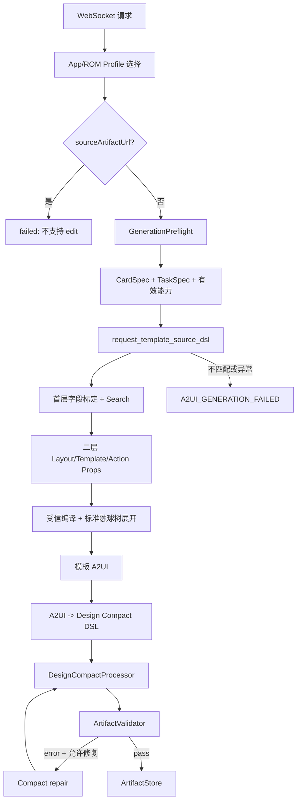

# `generateWidgetCardTerseDslNested2` Template 数据流

本文说明 Tersel 入口的当前生产实现。对外契约以
[云侧方案设计](../../../../../docs/云侧方案设计.md) 为准；模板内部 Search、二层组合和受信展开见
[architecture.md](architecture.md)。

## 1. 入口特性

| 项目 | 当前实现 |
| --- | --- |
| WebSocket | `/api/v1/ws/tools/generateWidgetCardTerseDslNested2` |
| 请求模型 | `GenerateWidgetCardRequest` |
| 生产源路线 | Template only |
| 公共 Processor | `DslProcessorKind.DESIGN_COMPACT` |
| edit | 不支持，入口直接 `failed` |
| Template 异常 | `need_fallback=false`，不调用原 Tersel 或 Compact 首次生成 |
| 内部表达 | CardTpl + 受限 Tersel |
| 公共源产物 | Design Compact DSL |
| 最终产物 | 三段标准 A2UI |

主要代码：

- [WebSocket 路由](../../../api/routes.py)
- [Tersel 入口与公共生成链](../../widget_generation_service.py)
- [模板引擎](../engine/pipeline.py)
- [模板内部 Tersel 转换](../engine/tersel_converter.py)

## 2. 命名与实际处理器

该入口保留 `generateWidgetCardTerseDslNested2` operation 名称，但当前生产策略直接复用 Design Compact 链：

```text
processor_kind = DESIGN_COMPACT
source_format = design-compact-dsl
model_profile_id = design-compact-dsl
stores_design_token = true
try_template = true
need_fallback = false
```

Tersel 用于模板模块内部表达二层布局和受信展开结果。它在模板内部先转为 A2UI，
再回转为 Design Compact DSL 交给公共 Processor。项目不再保留公共 TerseDSL Processor 或兼容转换链。

## 3. 总流程



## 4. 请求、Profile 和 edit 门禁

WebSocket 路由执行包络归一化、Pydantic 校验、6 秒心跳和 final 帧包装。
`generate_widget_card_terse_dsl_nested2()` 通过 `_compact_protocol_selection()` 选择最终 Form Profile 和
Design Compact Profile。

如果请求的 `model_fields_set` 包含 `sourceArtifactUrl`，入口立即返回：

```text
status = failed
errorCode = A2UI_GENERATION_FAILED
message = 模板路线暂不支持二次更新
```

该分支不加载来源 artifact，不转为 create，也不尝试原 Compact edit。

## 5. 公共前置门禁

create 请求先进入与 Compact 相同的公共生成链。`GenerationPreflight` 负责：

- 校验数据能力、参数、写入路径、字段投影、事件和素材。
- 整单拒绝调用方契约错误，不让错误候选进入模板模型。
- 构造最终 CardSpec、TaskSpec、有效能力和移除项。

Template 只消费这些已裁决结果。它不查询 IDS，不自行增加数据绑定，也不生成 CardSpec。

## 6. 模板内部产物转换

二层输出经受信编译后，`TemplateEngineOutput` 同时保留：

- `tersel`：已展开的内部 Tersel。
- `a2ui`：内部 Tersel 确定性转换得到的三段 A2UI。
- `projected_task_spec`、`template_ids`、`theme_id` 和展开统计。

Facade 只把 `a2ui` 交给 `prepare_template_source_dsl()`：

```text
模板 A2UI
  -> 校验三段消息和 surfaceId
  -> 写入当前 catalogId 与 Form 根样式
  -> convert_a2ui_to_compact_dsl
  -> Design Compact DSL
```

因此 artifact 的 `designcompactdsl` 保存 Design Compact DSL，不保存内部 Tersel。

命中融球 Theme 时，模板编译器在 Tersel 组件树中直接展开标准 `Stack` 定位层、三组球体和玻璃层，
并给前景内容根 ID 增加 `__genui_render_component__` 前缀。Tersel、A2UI 和 A2UI-Compact 均不包含
`FusionBall` 云端组件。

## 7. 严格失败与 repair 边界

Tersel 入口传入 `need_fallback=false`。因此以下异常都在 source DSL 返回前终止：

- 模板模型运行时不可用。
- 首层字段标定或 Search 不匹配。
- Provider/Template/Theme/Layout 资源无法严格加载。
- 二层输出在模板内部修复后仍无法编译。
- 模板 A2UI 无法适配 Profile 或回转 Design Compact DSL。

这些情况不调用原 Tersel 模型，也不调用原 Compact 首次生成，最终转为
`A2UI_GENERATION_FAILED`。

只有模板已成功返回 Design Compact DSL 后，公共 Processor 或 Validator 发现的质量错误才能进入
Compact repair。repair 不重跑首层、Search、二层或 CardTpl 展开。

## 8. Artifact 和响应

成功时：

- `genui` 保存最终标准 A2UI。
- `designcompactdsl` 保存模板 A2UI 回转的 Design Compact DSL。
- `meta.generationMode` 为 `create`。
- CardSpec、TaskSpec、generation plan、能力和 artifact URL 全部由公共生成链管理。

终止点：

| 阶段 | 结果 |
| --- | --- |
| 请求或包络非法 | 路由层参数错误 |
| App/ROM 无可用 Profile | `APP_VERSION_UNSUPPORTED` |
| 请求包含 `sourceArtifactUrl` | 入口直接 `failed` |
| GenerationPreflight 契约错误 | 模型未调用，整单拒绝 |
| Template 不匹配或异常 | `A2UI_GENERATION_FAILED`，不回退 |
| Processor/Validator 最终失败 | `VALIDATION_FAILED`，不保存 |
| artifact 保存或上传失败 | 路由层服务失败，不伪造成功 URL |
